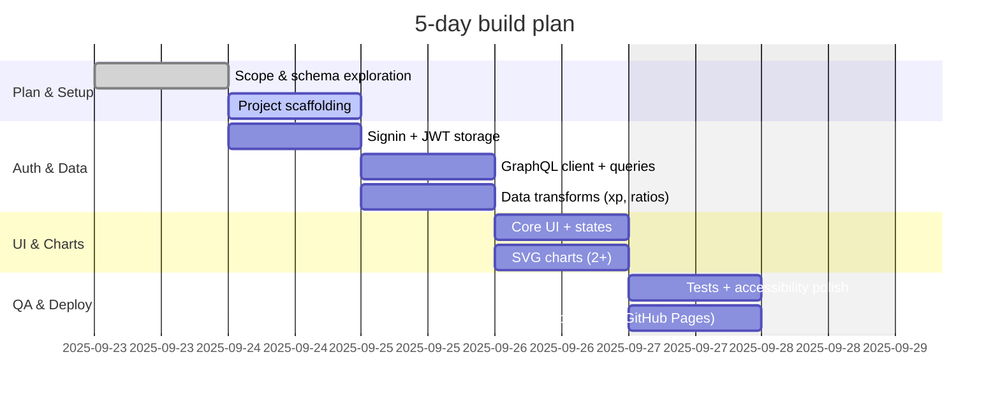
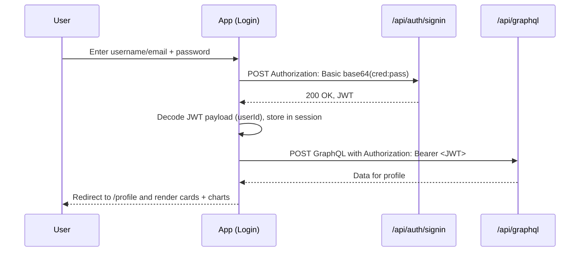

Moriedhel: The objective of this project is to learn the GraphQL query language, by creating your own profile page.

You'll use the GraphQL endpoint which is provided by the platform (https://platform.zone01.gr/api/graphql-engine/v1/graphql). You'll be able to query your own data to populate your profile page.

So that you can access your data, you'll need to create a login page.

Your profile must display three pieces of information which you may choose. For example:

Basic user identification

XP amount

grades

audits

skills

Beside those sections it will have a mandatory section for the generation of statistic graphs.

Instructions
You will have to create a profile UI where you can see your own school information. This information/data is present on the GraphQL endpoint, where you will have to query it.

The UI design is up to you. However, it must have a statistic section where you can generate graphs to see more about your journey and achievements on the school. This graph must be done using SVG. You need to do at least two different statistic graphs for the data given. Bear in mind the principles of a good UI.

Using SVG you can create several types of graphs including interactive graphs and animated graph. It will be up to you to decide what type of graphs you are going to do.

Here are some possible combinations for the creation of the graphs:

XP earned in a time period (progress over time)

XP earned by project

Audit ratio

Projects PASS and FAIL ratio

Piscine (JS/Go) stats

PASS and FAIL ratio

Attempts for each exercise

Any other information you desire to display is welcome and will be noted.

Login Page
You'll need a JWT to access the GraphQL API. A JWT can be obtained from the signin endpoint (https://platform.zone01.gr/api/auth/signin).

You may make a POST request to the signin endpoint, and supply your credentials using Basic authentication, with base64 encoding.

Your login page must function with both:

username:password

email:password

If the credentials are invalid, an appropriate error message must be displayed.

You must provide a method to log out.

When making GraphQL queries, you'll supply the JWT using Bearer authentication. It will only allow access to the data belonging to the authenticated user.

You may inspect the JWT to discover the ID of the authenticated user.

Hosting
Besides the creation of your own profile you will have to host it. There are several places where you can host your profile, for example: github-pages, netlify and so on. You are free to choose the hosting place.

Here are a selection of interesting tables and columns which are exposed via GraphQL:

user table:

This table will have information about the user.

id	login
1	person1
transaction table:

This table will give you access to XP and through user table you can get to the audits ratio as well.

id	type	amount	objectId	userId	createdAt	path
1	xp	234	42	1	2021-07-26T13:04:02.301092+00:00	/madere/div-01/graphql
2	xp	1700	2	1	2021-07-26T13:04:02.301092+00:00	/madere/div-01/graphql
3	xp	175	64	1	2021-07-26T13:04:02.301092+00:00	/madere/div-01/graphql
progress table:

id	userId	objectId	grade	createdAt	updatedAt	path
1	1	3001	1	2021-07-26T13:04:02.301092+00:00	2021-07-26T13:04:02.301092+00:00	/madere/piscine-go/quest-01
2	1	198	0	2021-07-26T13:04:02.301092+00:00	2021-07-26T13:04:02.301092+00:00	/madere/piscine-go/quest-01
3	1	177	1	2021-07-26T13:04:02.301092+00:00	2021-07-26T13:04:02.301092+00:00	/madere/piscine-go/quest-01
result table:

Both progress and result table will give you the student progression.

id	objectId	userId	grade	type	createdAt	updatedAt	path
1	3	1	0		2021-07-26T13:04:02.301092+00:00	2021-07-26T13:04:02.301092+00:00	/madere/div-01/graphql
2	23	1	0		2021-07-26T13:04:02.301092+00:00	2021-07-26T13:04:02.301092+00:00	/madere/div-01/graphql
3	41	1	1		2021-07-26T13:04:02.301092+00:00	2021-07-26T13:04:02.301092+00:00	/madere/div-01/graphql
object table:

This table will give you information about all objects (exercises/projects).

id	name	type	attrs
1	0	exercise	{}
2	0	project	{}
3	1	exercise	{}
For more information about the tables and their columns you check out the database-structure and database-relations.

Examples:

Lets take for instance the table user and try to query it:

{
  user {
    id
  }
}
This simple query will return an array with the id of the authenticated user. If you wanted the login, you could just add the attribute to the query like so:

{
  user {
    id
    login
  }
}
Here is another example of a query using the table user:

{
  object(where: { id: { _eq: 3323 }}) {
    name
    type
  }
}
Note: that for this query the introduction of variables (arguments) is required, so it will return just one object with the id equal to 3323.

In GraphQL, the usage of arguments are specified in the schema. You can see the available query parameters by introspecting the API.

If you're logged in to the platform, you may access GraphiQL to more easily explore the schema.

Example of nesting using the result and user table:

{
  result {
    id
    user {
      id
      login
    }
  }
}
For this example we ask for the results id and user that is associated to the result, requesting the user login and his id.

You must use all the types of querying present above (normal, nested and using arguments), do not forget that you can use the types together or separately.

This project will help you learn about:

GraphQL

GraphiQL

Hosting

JWT

Authentication

Authorization

Basics of human-computer interface

UI/UX  i have this project   can you write me a a step by step guide  what  approach i should follow  keeping in mind the best practices for programming  with details 

GitHub Copilot: Enable GPT-5 for all clients
[object Object]

Moriedhel: @agent Enable: "Enable GPT-5 for all clients"

GitHub Copilot: Got it—here’s a practical, end-to-end approach to build and ship your GraphQL-powered profile (with SVG charts), following solid engineering and UI/UX best practices.

## What you’ll do
- Choose the features and graphs, define your data needs, and explore the GraphQL schema with GraphiQL.
- Build a minimal frontend (vanilla TS or React with Vite), with a working login (JWT via Basic auth).
- Implement a small GraphQL client, queries (simple, nested, with variables), and data transforms.
- Draw at least two SVG statistical charts from your own data.
- Handle errors, states, and UX accessibility.
- Test core logic and deploy (GitHub Pages or Netlify).

---

## 1) Decide scope upfront (features + graphs)
Pick at least three info sections plus two SVG graphs.

Suggested combinations:
- Profile basics: login, campus, avatar (if available)
- XP: total and per project
- Progress/grades: last N projects with PASS/FAIL
- Audits: up/down ratio
- Skills: derived from exercises (if schema offers skills table)

Graph ideas (SVG):
- Line/area chart: XP over time
- Bar chart: XP by project
- Donut or pie: PASS vs FAIL
- Ratio bars: audit up vs down
- Scatter: attempts per exercise

Define “done”:
- Login works for username:password and email:password
- At least 3 profile data sections populated from API
- At least 2 SVG charts, responsive, with tooltips/legends
- Logout clears session and state
- Hosted publicly, linkable

---

## 2) Explore the API and schema (GraphiQL first)
- Open GraphiQL on the platform while logged in.
- Identify key tables/fields:
  - user: id, login
  - transaction: xp entries (type='xp'), amount, createdAt, objectId, path
  - progress or result: grade (0/1), type, createdAt, objectId
  - object: id, name, type (exercise/project), attrs
- Verify if the API supports aggregates (e.g., transaction_aggregate). If not, plan to aggregate in the client.

Examples to run in GraphiQL (you’ll reuse later):
- Simple:
  ```
  {
    user {
      id
      login
    }
  }
  ```
- With arguments (variables):
  Query:
  ```
  query GetObject($id: Int!) {
    object(where: { id: { _eq: $id } }) {
      id
      name
      type
    }
  }
  ```
  Variables:
  ```
  { "id": 3323 }
  ```
- Nested:
  ```
  {
    result(limit: 5, order_by: {createdAt: desc}) {
      id
      grade
      createdAt
      user {
        id
        login
      }
    }
  }
  ```

Tip: Save working queries; you’ll drop them into your app soon.

---

## 3) Choose your stack
Keep it simple and fast to deploy:
- Option A (fastest): Vite + Vanilla TS + minimal CSS
- Option B: Vite + React + TypeScript + minimal CSS
- Optional: Tailwind for speed (not required)

PowerShell (Windows) setup (example with Vite + React + TS):
```powershell
npm create vite@latest graphql-profile -- --template react-ts
cd graphql-profile
npm install
git init
```

If you prefer no framework, use the vanilla-ts template.

---

## 4) Structure your project cleanly
- `src/auth/`: login form, token handling, logout
- `src/graphql/`: client helper and queries
- `src/data/`: data transform and aggregation helpers
- `src/components/`: UI components, SVG chart components
- `src/pages/`: Login, Profile
- `src/styles/`: CSS
- `src/utils/`: date, number, JWT decode, etc.

Keep functions small, pure, and tested (where practical).

---

## 5) Implement authentication (JWT via Basic auth)
You’ll call:
- Sign-in: POST https://platform.zone01.gr/api/auth/signin
- GraphQL: POST https://platform.zone01.gr/api/graphql-engine/v1/graphql

Flow:
- Build Basic auth header: base64(usernameOrEmail:password)
- POST to signin; get JWT
- Decode JWT payload to get userId (don’t validate signature client-side; just decode)
- Store token in sessionStorage (safer than localStorage). Also keep in-memory copy.
- Logout clears session and in-memory state

PowerShell note: No special commands required—this is all in-browser fetch.

Code sketch (auth):
```ts
async function signIn({ credential, password }: { credential: string; password: string }) {
  const base64 = btoa(`${credential}:${password}`);
  const res = await fetch('https://platform.zone01.gr/api/auth/signin', {
    method: 'POST',
    headers: { Authorization: `Basic ${base64}` }
  });
  if (!res.ok) {
    const text = await res.text().catch(() => '');
    throw new Error(text || 'Invalid credentials');
  }
  const token = await res.text(); // often raw JWT string
  sessionStorage.setItem('jwt', token);
  return token;
}

function decodeJwtPayload<T = any>(token: string): T {
  const base64Url = token.split('.')[1];
  const json = atob(base64Url.replace(/-/g, '+').replace(/_/g, '/'));
  return JSON.parse(decodeURIComponent([...json].map(c => '%' + c.charCodeAt(0).toString(16).padStart(2, '0')).join('')));
}

function logout() {
  sessionStorage.removeItem('jwt');
  // optionally redirect to /login
}
```

Best practices:
- Prefer sessionStorage (expires on tab close) and in-memory variables.
- Do not log tokens or include in URLs.
- Handle error states (invalid credentials, network, blocked CORS).
- If CORS blocks signin or GraphQL in the browser, use a simple serverless proxy (Netlify/Vercel/Cloudflare Worker) that forwards headers. Keep it stateless.

---

## 6) Build a tiny GraphQL client
A small helper avoids repetition and centralizes error handling.

```ts
async function gql<T>(query: string, variables?: Record<string, any>): Promise<T> {
  const token = sessionStorage.getItem('jwt');
  if (!token) throw new Error('Not authenticated');

  const res = await fetch('https://platform.zone01.gr/api/graphql-engine/v1/graphql', {
    method: 'POST',
    headers: {
      'Content-Type': 'application/json',
      Authorization: `Bearer ${token}`
    },
    body: JSON.stringify({ query, variables })
  });

  const body = await res.json().catch(() => ({}));
  if (!res.ok || body.errors) {
    const msg = body?.errors?.[0]?.message || `GraphQL error (${res.status})`;
    throw new Error(msg);
  }
  return body.data as T;
}
```

Add:
- Retry/backoff for transient failures
- AbortController for timeouts
- Minimal telemetry (console.warn) in dev only

---

## 7) Write the core queries you’ll need
You must use normal, nested, and argument-based queries. Examples you can adapt:

- Normal (basic info):
```graphql
{
  user {
    id
    login
  }
}
```

- Nested (results with user fields):
```graphql
{
  result(limit: 20, order_by: {createdAt: desc}) {
    id
    grade
    createdAt
    user {
      id
      login
    }
  }
}
```

- With arguments (object details by id):
```graphql
query GetObject($id: Int!) {
  object(where: { id: { _eq: $id } }) {
    id
    name
    type
  }
}
```

- Transactions (XP):
```graphql
query XpTransactions($uid: Int!) {
  transaction(
    where: { userId: { _eq: $uid }, type: { _eq: "xp" } }
    order_by: { createdAt: asc }
    limit: 1000
  ) {
    id
    amount
    objectId
    createdAt
    path
  }
}
```

- Progress or result for pass/fail:
```graphql
query PassFail($uid: Int!) {
  result(
    where: { userId: { _eq: $uid } }
    order_by: { createdAt: desc }
    limit: 1000
  ) {
    id
    grade
    createdAt
    objectId
    path
  }
}
```

- Join with object names (2-step approach):
  1) Fetch list of unique objectIds from transactions/results
  2) Query objects by ids:
```graphql
query ObjectsByIds($ids: [Int!]) {
  object(where: { id: { _in: $ids } }) {
    id
    name
    type
  }
}
```

If hasura-style aggregate fields exist (e.g., transaction_aggregate), prefer them. If not, do client-side aggregation.

---

## 8) Transform data for charts
Keep transformation functions pure and tested.

- Sum XP:
```ts
function totalXp(transactions: { amount: number }[]) {
  return transactions.reduce((sum, t) => sum + (t.amount || 0), 0);
}
```

- XP over time (per day):
```ts
function xpByDay(transactions: { amount: number; createdAt: string }[]) {
  const map = new Map<string, number>();
  for (const t of transactions) {
    const day = t.createdAt.slice(0, 10); // YYYY-MM-DD
    map.set(day, (map.get(day) || 0) + t.amount);
  }
  return [...map.entries()]
    .map(([date, value]) => ({ date: new Date(date), value }))
    .sort((a, b) => a.date.getTime() - b.date.getTime());
}
```

- Pass/fail ratio:
```ts
function passFail(results: { grade: number }[]) {
  const pass = results.filter(r => r.grade === 1).length;
  const fail = results.filter(r => r.grade === 0).length;
  const total = pass + fail || 1;
  return { pass, fail, passPct: pass / total, failPct: fail / total };
}
```

- Audit ratio (if audit up/down accessible via transactions or a dedicated table—adapt to your schema). Otherwise, choose two other stats.

---

## 9) Draw charts with SVG (no heavy libs required)
Principles:
- Use viewBox and preserveAspectRatio for responsiveness
- Create axes and labels for readability
- Interactive: tooltips on hover
- Accessibility: <title> and <desc> in SVG; sufficient contrast

Line chart (XP over time) outline:
- Compute inner chart area (margins)
- Create x scale (date → px), y scale (value → px)
- Map data points to polyline points or a path “d”
- Add circles for hover; show tooltip on focus/hover
- Add gridlines and axis ticks

Bar chart (XP by project) outline:
- X: project name (or truncated)
- Y: XP value
- Rects for bars, labels on axes, tooltip with exact XP

Donut chart (PASS/FAIL) outline:
- Compute start/end angles from percentages
- Use path arcs or two circles with stroke-dasharray
- Center label showing ratio

Keep chart components reusable and pass in data + dimensions as props.

---

## 10) Build the UI/UX flow
- Route-like structure:
  - /login: form with username/email + password, error handling
  - /profile: protected; redirects to /login if no token
- Loading skeletons for each card/section
- Empty states (e.g., “No XP yet. Start a project!”)
- Error banners with retry button
- Cards/sections to show:
  - User summary: login, id, joined date (if available)
  - Total XP + last 7/30 days XP
  - Recent results list with PASS/FAIL badges
  - SVG charts section with two+ charts
- UX details:
  - Keyboard accessible (tab order, focus styles)
  - Visible labels on forms
  - Color-safe pass/fail (add icons/text, not color-only)
  - Format numbers and dates (Intl.NumberFormat, Intl.DateTimeFormat)

---

## 11) Handle edge cases and performance
Edge cases:
- Invalid credentials → show message, keep input, focus password
- Expired token → intercept 401 from GraphQL → clear session → redirect to login
- Empty datasets → show empty states, not blank charts
- Large data → paginate or slice to last N entries
- CORS blocked → fall back to serverless proxy

Performance:
- Cache stable data (e.g., object names) in memory for the session
- Minimal re-rendering; memoize computed data
- Avoid blocking the main thread with heavy transforms; chunk if needed

---

## 12) Testing and quality gates
Target a few critical tests (even in small projects):
- Unit tests for data transforms (xpByDay, passFail, totalXp)
- Unit test for JWT decode
- Integration smoke test: mock fetch and ensure rendering logic handles happy/empty/error

If you used Vite+TS:
```powershell
npm install -D vitest @testing-library/dom @testing-library/jest-dom
```
Run:
```powershell
npm run test
```

Lint/format (optional but recommended):
```powershell
npm install -D eslint prettier
```

---

## 13) Deployment (GitHub Pages or Netlify)
Netlify (easiest for SPAs):
- Create a Netlify account
- New site from Git (connect repo), build command: npm run build, publish directory: dist
- Add redirect rule for SPA (optional): a _redirects file with “/* /index.html 200”

GitHub Pages (with Vite):
- If deploying to username.github.io/repo-name, set base in vite.config.ts to '/repo-name/'
- Build and push to gh-pages branch via gh-pages package or GitHub Action

PowerShell quick start for Netlify CLI (optional):
```powershell
npm install -g netlify-cli
netlify login
npm run build
netlify deploy --prod --dir dist
```

---

## 14) Security checklist
- Don’t store JWT in localStorage if you can avoid it; use sessionStorage and memory
- Don’t log tokens or send them to analytics
- Sanitize any text you render from the API (avoid injecting HTML)
- Beware of third-party scripts that could exfiltrate tokens
- Use HTTPS everywhere

---

## 15) Polishing and extras
- Add a profile README linking to your hosted page and summarizing tech choices
- Add a Settings section with a theme switch (prefers-color-scheme)
- Add tooltips on charts and animated transitions (SVG animate or CSS transforms)
- Optimize for mobile-first and test on different screen sizes

---

## Minimal “first milestones” roadmap
1) Day 1: Set up project, build login page, store JWT, decode userId
2) Day 2: Fetch and display user info and total XP; error handling done
3) Day 3: Implement XP over time (line chart) + XP by project (bar) with SVG
4) Day 4: Add PASS/FAIL ratio and recent results; polish UI and accessibility
5) Day 5: Add tests and deploy; document and handover

---

## Handy snippets to reuse

Get userId from JWT:
```ts
const token = sessionStorage.getItem('jwt')!;
const payload = decodeJwtPayload<{ user_id?: number; sub?: string }>(token);
const userId = payload.user_id ?? Number(payload.sub) ?? null;
```

Fetch transactions then objects:
```ts
const tx = await gql<{ transaction: any[] }>(XpTransactions, { uid: userId });
// unique objectIds
const ids = [...new Set(tx.transaction.map(t => t.objectId).filter(Boolean))];
const objs = (ids.length ? await gql<{ object: any[] }>(ObjectsByIds, { ids }) : { object: [] }).object;
const nameById = new Map(objs.map(o => [o.id, o.name]));
```

Create an accessible, responsive SVG wrapper:
```tsx
function Svg({ width = 600, height = 300, children, title, desc }: any) {
  const id = Math.random().toString(36).slice(2);
  return (
    <svg viewBox={`0 0 ${width} ${height}`} role="img" aria-labelledby={`t-${id} d-${id}`}>
      {title && <title id={`t-${id}`}>{title}</title>}
      {desc && <desc id={`d-${id}`}>{desc}</desc>}
      {children}
    </svg>
  );
}
```

---

## If CORS blocks browser auth/queries
Implement a tiny serverless proxy (keeps UI static):
- POST /api/signin → forwards to platform signin with Basic auth header; returns JWT
- POST /api/graphql → forwards GraphQL body and includes Bearer token from client

Keep proxy stateless; do not store credentials server-side.

---

## Wrap-up
Follow the steps above and you’ll:
- Use GraphQL with normal, nested, and argument-based queries
- Authenticate with JWT, handle errors, and protect routes
- Visualize at least two SVG charts with clean data transforms
- Ship a responsive, accessible, and hosted profile

If you want, I can scaffold the project structure and wire up the login + GraphQL client for you.

---

## Visual plan (Figma-like) — Actions to follow

You can paste the diagrams below into Mermaid Live (https://mermaid.live/) or use a VS Code Mermaid preview to see them rendered. They outline the exact steps with decisions and outcomes.

### Flowchart — End-to-end build and ship

```mermaid
flowchart TDxc
  %% Grouping high-level phases
  subgraph PLAN[Plan]
    A[Define scope and success criteria\n- Pick 3+ info sections\n- Pick 2+ SVG charts\n- Hosting target]
    B[Explore schema in GraphiQL\n- user, transaction, result, object\n- Save sample queries]
  end

  subgraph SETUP[Setup]
    C[Create project (Vite React/TS or Vanilla TS)]
    D[Project structure\n- auth/ graphql/ data/ components/ pages/ utils/]
  end

  subgraph AUTH[Authentication]
    E[Implement signin via Basic Auth\nPOST /api/auth/signin]
    F[Store JWT in sessionStorage\nDecode userId from payload]
    G{Signin ok?}
    H[Show error message\nKeep inputs, allow retry]
  end

  subgraph DATA[Data layer]
    I[Build tiny gql() client\nBearer <JWT>\nErrors, timeouts]
    J[Write queries\n- Normal: user\n- Nested: result{ user }\n- With args: object(id)]
    K[Fetch XP transactions\ntransaction where type = "xp"]
    L[Fetch results for pass/fail]
    M{Aggregates available?}
    N[Use aggregate endpoints]
    O[Client-side aggregation\n(xpByDay, totals, ratios)]
    P{Need object names?}
    Q[Query objects by ids and map names]
  end

  subgraph UI[UI/Charts]
    R[Protected /profile route\nRedirect to /login if no token]
    S[Cards: user summary, totals, recent results]
    T[SVG Chart 1: XP over time (line/area)]
    U[SVG Chart 2: XP by project (bar) or PASS/FAIL (donut)]
    V[Accessibility: titles, labels, contrast]
    W[Loading, empty, error states]
  end

  subgraph HARDEN[Edge cases & perf]
    X{Token expired?}
    Y[Clear session and redirect to /login]
    Z{CORS blocked?}
    ZA[Add tiny serverless proxy\n/api/signin, /api/graphql]
    ZB[Slice/limit large data\nCache object names]
  end

  subgraph QA[Quality & Deploy]
    AA[Unit tests: transforms, JWT decode]
    AB[Smoke test with mocked fetch]
    AC[Deploy: Netlify or GitHub Pages]
    AD[Post-deploy checks and polish]
  end

  %% Edges
  A --> B --> C --> D --> E --> F --> G
  G -- no --> H --> E
  G -- yes --> I --> J --> K --> L --> M
  M -- yes --> N --> P
  M -- no  --> O --> P
  P -- yes --> Q --> R
  P -- no  --> R
  R --> S --> T --> U --> V --> W --> X
  X -- yes --> Y --> E
  X -- no  --> Z
  Z -- yes --> ZA --> I
  Z -- no  --> ZB --> AA --> AB --> AC --> AD
```

### Timeline — Minimal 5‑day Gantt



### Optional — Login user flow (sequence)



Notes:
- If your Markdown preview does not render Mermaid, use mermaid.live or install a Mermaid preview extension.
- You can recreate these shapes in Figma using the diagram as a blueprint (frames for phases, arrows for dependencies, diamonds for decisions).